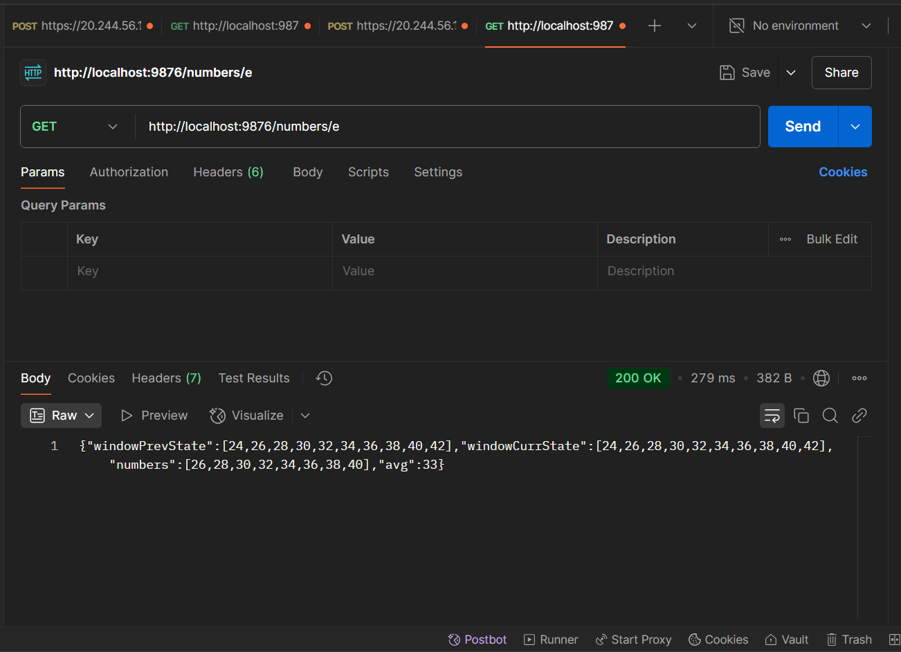
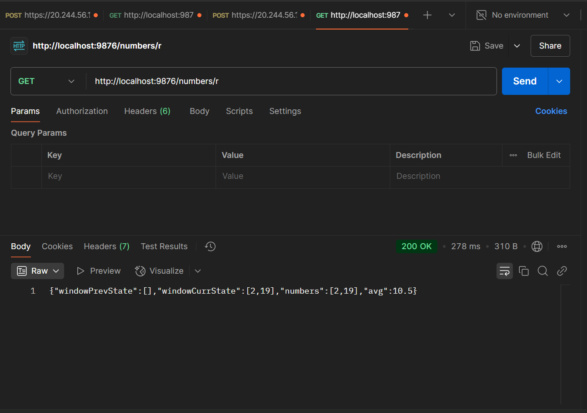

# 1

### prime
REQUEST TIMEOUT - more then 5ms

first-response

second-response

third-response

### fibonacci
first-response

second-response

third-response

### even
first-response

second-response

third-response

fourth-response

### random
first-response

second-response

third-response

fourth-response

fifth-response
